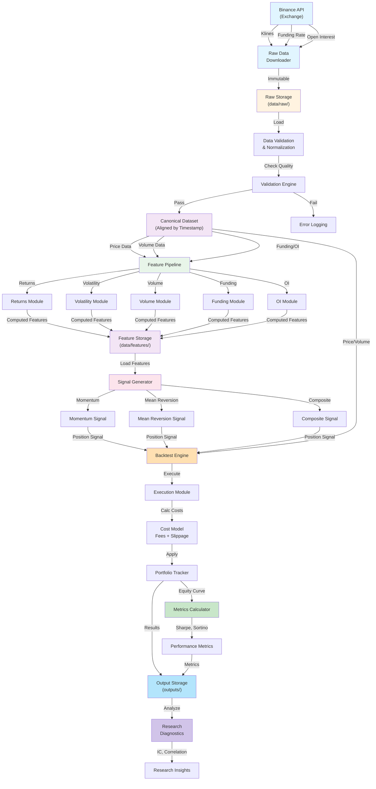

# Crypto Quant Research System

A modular cryptocurrency quantitative research and trading system focused on BTCUSDT Perpetual futures on Binance.

## Overview

This repository provides a clean, research-first architecture for:

- **Historical data collection** from Binance (klines, funding rates, open interest)
- **Data validation and normalization** with look-ahead bias protection
- **Feature engineering** (returns, volatility, volume, funding, open interest)
- **Signal generation** (momentum, mean reversion, composite strategies)
- **Backtesting** with realistic transaction costs
- **Performance analysis** and research diagnostics

## Key Principles

1. **Research Quality First** - Prioritize correctness and clarity over speed
2. **Look-ahead Bias Protection** - Strict separation of features and future targets
3. **Modular Architecture** - Clear separation between data, features, signals, backtest, and analysis
4. **Configurable** - All assumptions (fees, dates, intervals) are configurable
5. **Reproducible** - Deterministic outputs for research validation

## Project Structure

```
crypto-quant/
├── config/              # Configuration files (YAML)
├── data/
│   ├── raw/            # Raw downloaded data (immutable)
│   ├── processed/      # Cleaned and aligned datasets
│   └── features/       # Computed features
├── src/crypto_quant/   # Main Python package
│   ├── data/          # Data loading, validation, storage
│   ├── features/      # Feature engineering
│   ├── signals/       # Signal generation
│   ├── backtest/      # Backtesting engine
│   ├── research/      # Analysis and diagnostics
│   └── utils/         # Utilities
├── scripts/            # Executable scripts
├── notebooks/          # Research notebooks
├── tests/              # Unit tests
└── outputs/            # Reports and results
```

## Quick Start

### 1. Setup Environment

```bash
cd Bit_firstattempt              # Navigate to project root directory
python -m venv venv
source venv/bin/activate        # On Windows: venv\Scripts\activate
pip install -e .                # Install from project root (where pyproject.toml is)
```

### 2. Configure API Keys

```bash
cp .env.example .env
# Edit .env with your Binance API credentials
```

### 3. Download Historical Data

```bash
python scripts/download_klines.py
python scripts/download_funding.py
python scripts/download_open_interest.py
```

### 4. Build Research Dataset

```bash
python scripts/build_dataset.py
```

### 5. Run Backtest

```bash
python scripts/run_backtest.py
```

## Architecture

### Data Flow

```
Binance API → Raw Data → Validation → Normalization → Alignment → Features → Signals → Backtest → Metrics
```

### System Architecture Diagram



### Module Interaction Flow

```mermaid
graph LR
    subgraph Data["📊 Data Layer"]
        D1["Binance Client"]
        D2["Validation"]
        D3["Storage"]
    end
    
    subgraph Features["🔧 Feature Layer"]
        F1["Returns"]
        F2["Volatility"]
        F3["Volume"]
        F4["Funding"]
        F5["OI"]
    end
    
    subgraph Signals["⚡ Signal Layer"]
        S1["Momentum"]
        S2["Mean Reversion"]
        S3["Composite"]
    end
    
    subgraph Backtest["📈 Backtest Layer"]
        B1["Engine"]
        B2["Execution"]
        B3["Costs"]
    end
    
    subgraph Research["🔬 Research Layer"]
        R1["IC Analysis"]
        R2["Correlations"]
        R3["Diagnostics"]
    end
    
    Data -->|Canonical Data| Features
    Features -->|Feature Matrix| Signals
    Signals -->|Position Signal| Backtest
    Backtest -->|Equity Curve| Research
    
    style Data fill:#e1f5ff
    style Features fill:#e8f5e9
    style Signals fill:#fce4ec
    style Backtest fill:#ffe0b2
    style Research fill:#d1c4e9
```



### Key Components

#### Data Module (`crypto_quant/data/`)
- `binance_client.py` - Exchange API interface
- `loaders.py` - Load data from storage
- `downloader.py` - Download data from exchange
- `validation.py` - Data quality checks
- `storage.py` - Persist data to disk
- `schemas.py` - Data schemas (Pydantic)

#### Features Module (`crypto_quant/features/`)
- `returns.py` - Return calculations (simple, log)
- `volatility.py` - Volatility estimators (realized, Parkinson, Garman-Klass)
- `volume.py` - Volume metrics and OBV
- `funding.py` - Funding rate features
- `open_interest.py` - Open interest features
- `feature_pipeline.py` - Orchestrate feature computation

#### Signals Module (`crypto_quant/signals/`)
- `base.py` - Abstract signal base class
- `momentum.py` - Momentum-based signals
- `mean_reversion.py` - Mean reversion signals
- `composite.py` - Combine multiple signals

#### Backtest Module (`crypto_quant/backtest/`)
- `engine.py` - Main backtesting engine
- `portfolio.py` - Portfolio state tracking
- `execution.py` - Order execution simulation
- `costs.py` - Transaction cost modeling
- `metrics.py` - Performance metrics calculation

#### Research Module (`crypto_quant/research/`)
- `factor_analysis.py` - Factor performance analysis
- `ic.py` - Information coefficient
- `correlations.py` - Correlation analysis
- `diagnostics.py` - Sanity checks and diagnostics

## Configuration

### Main Configuration (`config/settings.yaml`)
Global project settings, dates, and symbols.

### Data Configuration (`config/data.yaml`)
Data source schemas, fields, validation rules.

### Backtest Configuration (`config/backtest.yaml`)
Backtest parameters, costs, metrics.

## Research Workflow

### Step 1: Understand Your Data
```python
from crypto_quant.data.loaders import load_canonical_dataset
from crypto_quant.research.diagnostics import ResearchDiagnostics

data = load_canonical_dataset()
print(data.head())
print(ResearchDiagnostics.analyze_signal_distribution(signal))
```

### Step 2: Develop Features
```python
from crypto_quant.features.returns import simple_returns
from crypto_quant.features.volatility import realized_volatility

returns = simple_returns(data['close'])
vol = realized_volatility(returns, window=20)
```

### Step 3: Generate Signals
```python
from crypto_quant.signals.momentum import MomentumSignal

signal = MomentumSignal(lookback=5)
positions = signal.generate(data)
```

### Step 4: Backtest
```python
from crypto_quant.backtest.engine import BacktestEngine
from crypto_quant.backtest.metrics import MetricsCalculator

backtest = BacktestEngine(data, positions)
results = backtest.run()

metrics = MetricsCalculator(results['equity_curve']).calculate_metrics()
```

### Step 5: Analyze Results
```python
from crypto_quant.research.ic import ICCalculator

ic = ICCalculator.calculate_rolling_ic(signal, future_returns)
```

## Look-Ahead Bias Protection

This system implements strict look-ahead bias protection:

- Features use only historical data (not future)
- Targets are computed separately (forward returns)
- Funding and OI are forward-filled AFTER observation, not before
- Each backtest period respects data availability at that point in time

## Testing

Run tests with pytest:

```bash
pytest tests/
pytest tests/test_features.py -v
pytest tests/test_backtest.py -v
```

## Performance Tips

1. **Data Alignment** - Ensure timestamps are properly aligned UTC
2. **Memory** - Use Polars for large datasets (faster, lower memory)
3. **Parquet Storage** - Partition by month for efficient querying
4. **Look-ahead** - Always validate that features don't use future data
5. **Walk-forward** - Test on train/val/test splits, not just in-sample

## Future Extensions

After V1 is working, consider:

- Real-time WebSocket ingestion
- Order book data and analysis
- Multi-symbol universes
- Multi-exchange research
- Paper trading with live data
- Live execution layer
- Risk management and position limits
- ML-based feature selection
- Cloud deployment

## Development Guidelines

- Type hints for all functions
- Dataclasses for data structures
- Unit tests for financial calculations
- Documentation for complex logic
- Modular functions (single responsibility)
- Configuration over code
- Reproducible research

## Common Pitfalls

✗ **Don't** - Use future data in features
✗ **Don't** - Assume perfect execution at exact price
✗ **Don't** - Ignore transaction costs
✗ **Don't** - Over-optimize parameters on test set
✗ **Don't** - Hardcode symbols, dates, fees

✓ **Do** - Keep raw data immutable
✓ **Do** - Use UTC everywhere
✓ **Do** - Test on multiple time periods
✓ **Do** - Include realistic costs
✓ **Do** - Document assumptions

## References

- [Binance API Documentation](https://binance-docs.github.io/)
- [Quantitative Trading](https://www.goodreads.com/book/show/5755521-quantitative-trading) by Ernest P. Chan
- [Machine Learning for Algorithmic Trading](https://www.packtpub.com/product/machine-learning-for-algorithmic-trading) by Stefan Jansen

## License

MIT License - See LICENSE file for details

## Contributing

1. Follow the architecture principles
2. Add tests for new functionality
3. Update documentation
4. Ensure type hints
5. Check for look-ahead bias

## Contact

For questions or issues, please open a GitHub issue.
